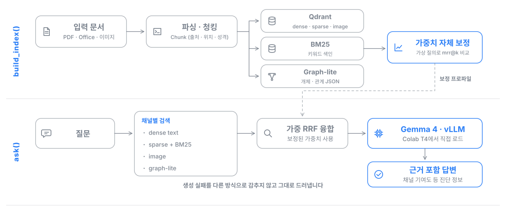

# Aerospace RAG — Colab에서 실행하는 3채널 문서 RAG


[](https://colab.research.google.com/github/NAMUORI00/aerospace-rag/blob/main/notebooks/aerospace_rag_colab_ui.ipynb)

항공우주 분야 문서(PDF, 엑셀, 워드, 파워포인트, 표 이미지)를 Google Colab 런타임 하나 안에서 파싱하고, 여러 검색 채널을 결합해 근거가 붙은 답변을 만드는 RAG입니다. [smartfarm-adaptive-rag](https://github.com/NAMUORI00/smartfarm-adaptive-rag)의 Dense, Sparse, Graph 3채널 검색 구조를 서버 없이 Colab T4에서 돌아가도록 단일 Python 패키지로 옮겼습니다.

## 한눈에 보기

- **목적**: 서버를 띄우지 않고도 업로드한 문서로 바로 색인을 만들고 질문할 수 있는 재현 가능한 RAG 데모
- **내가 한 일**: 형식별 문서 파서, Qdrant와 BM25, graph-lite 색인, 가중치 자체 보정, 가중 RRF 융합, vLLM 생성, Colab 실행 노트북, 색인 산출물 이동 기능까지 설계하고 구현했습니다.
- **특징**:
  - 색인을 만든 직후 가상 질의로 채널 가중치를 자체 보정해 저장하고, 검색 때는 그 값을 고정해서 씁니다.
  - 생성 모델이 실패하면 다른 방식으로 답을 꾸며 내지 않고 실패를 그대로 드러냅니다.
  - 응답에 채널별 기여도와 가중치 출처를 담아, 어떤 근거가 왜 올라왔는지 확인할 수 있습니다.
  - 테스트 66개로 공개 API, 색인, 검색, 노트북 실행 계약을 고정했습니다.

## 처리 흐름



공개 API는 `build_index()`와 `ask()` 두 개입니다. `build_index()`는 문서를 청크로 나눠 세 저장소에 기록하고 융합 가중치를 보정하며, `ask()`는 채널별 검색 결과를 가중 RRF로 합쳐 상위 근거로 답변을 만듭니다. 모듈별 설명은 [docs/architecture.md](docs/architecture.md)에 있습니다.

## 실행 방법

**Colab**: 위의 Open in Colab 배지로 노트북을 열면 저장소 복제, 의존성 설치, 문서 업로드, 색인 생성, 검색 확인, 질의응답을 순서대로 실행합니다. 생성 모델은 `google/gemma-4-E4B-it`를 vLLM으로 T4에서 직접 로드합니다.

**로컬**

```bash
git clone https://github.com/NAMUORI00/aerospace-rag.git
cd aerospace-rag
pip install -r requirements.txt
python -m aerospace_rag.cli.ingest --data-dir data --index-dir data/index
python -m aerospace_rag.cli.query "H3 8호기 발사가 중단된 이유는?" --provider extractive --debug
```

`--provider extractive`는 LLM 없이 검색 결과만 확인하는 디버그 경로이고, GPU 환경에서는 `--provider vllm`으로 Gemma 4 답변을 생성합니다.

**테스트**

```bash
pip install pytest && python -m pytest -q
```

## 데이터

`data/`에는 실제 업무 문서 대신 같은 파일 이름으로 만든 **합성 데모 문서**(mock PDF, 엑셀, 표 이미지)만 들어 있습니다. 직접 가진 문서를 `data/`에 넣으면 지원 형식(`.pdf`, `.docx`, `.pptx`, `.xlsx`, `.xlsm`, 이미지, `.txt`, `.md`)을 모두 색인합니다.

## 디렉터리 구조

```text
aerospace-rag/
├── aerospace_rag/
│   ├── pipeline.py       # 공개 API: build_index(), ask()
│   ├── ingestion/        # 파일 발견, 형식별 파싱, 청크 생성
│   ├── stores/           # Qdrant, BM25, graph-lite 로컬 색인
│   ├── retrieval/        # 채널 점수, 가중치 보정, 가중 RRF 융합
│   ├── generation/       # vLLM, extractive 디버그 provider
│   ├── artifacts/        # 색인 산출물 내보내기와 가져오기
│   └── cli/              # ingest, query 명령
├── notebooks/            # Colab 실행 노트북
├── data/                 # 합성 데모 문서
└── tests/
```

## 기술 스택

| 영역 | 기술 |
|---|---|
| 문서 처리 | pypdf, openpyxl, Docling |
| 검색과 저장 | Qdrant (local), BM25, JSON graph-lite |
| 생성 | vLLM, Gemma 4 E4B |
| 실행 환경 | Google Colab T4, Jupyter |
| 개발 도구 | Claude Code, Codex (AI 코딩 에이전트) |

## 한계

- 서버 없이 동작하도록 임베딩은 해시 기반 경량 임베딩을 기본으로 씁니다. 학습된 임베딩 모델을 쓰는 운영형 검색은 [smartfarm-adaptive-rag](https://github.com/NAMUORI00/smartfarm-adaptive-rag)에서 다룹니다.
- 장기 운영 서버, 컨테이너 배포, 외부 LLM API 연동은 범위에 넣지 않았습니다.
